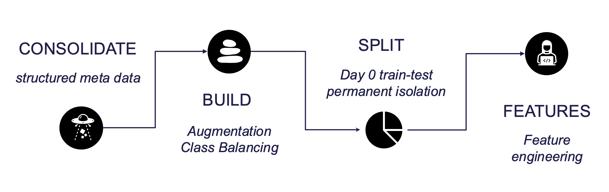
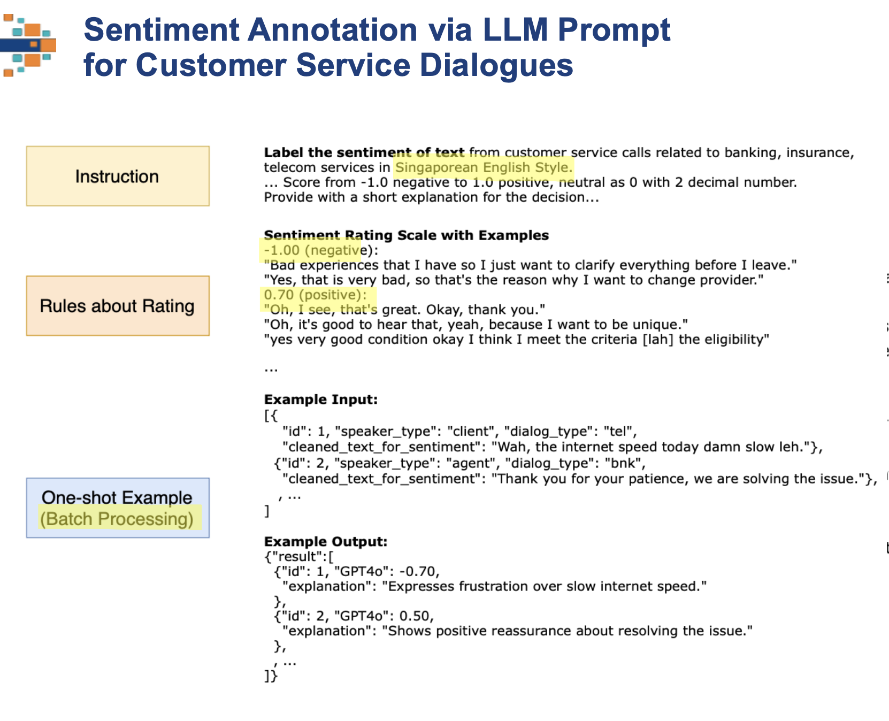
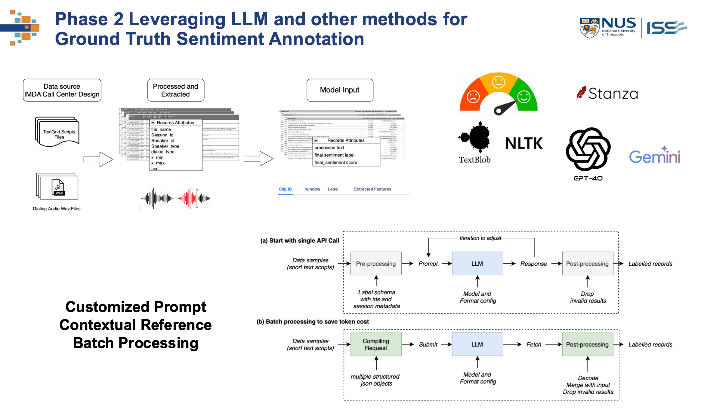
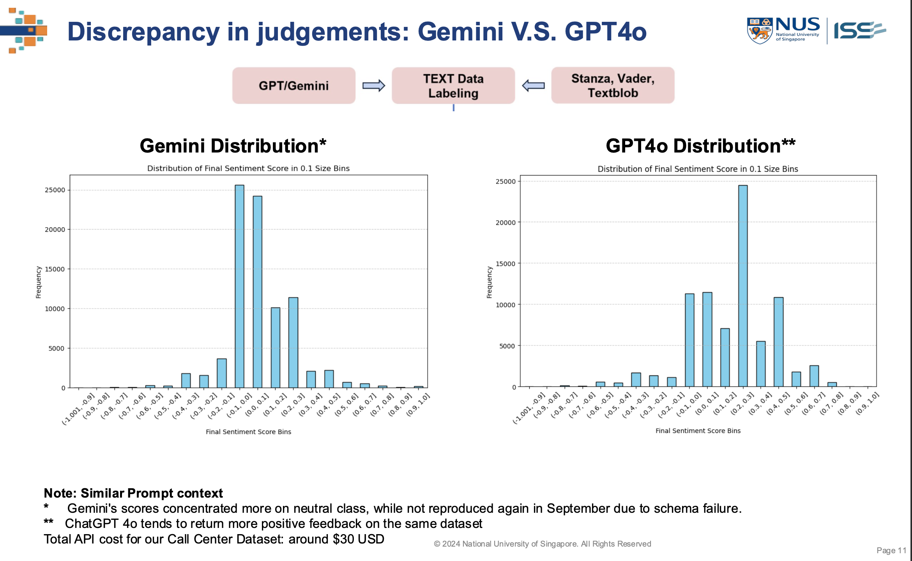

# IMDA_data_processing_analysis_sentiment

This repository contains notebooks, data, and visualizations for Our Capstone Sentiment Analysis Project Phase 2 of utilizing the Singapore IMDA Nation Corpus Speech Dataset - PART 6 Call Center Design Part.  
The project aims to develop and fine-tune models for analyzing sentiments in call center audio recordings.

## Overview

This project builds upon the foundation established in Phase 1, focusing on custom self-built audio sentiment dataset, for sentiment analysis in the call center context. The datasets used are derived from the IMDA National Speech Corpus, specifically the call center part, which provides a diverse set of dialogues for training and evaluation.

### Contents

	•	notebooks/: Contains various Jupyter notebooks for data processing, labeling, model training, evaluation, and voting analysis.
	•	doc/: This folder includes key visualizations that illustrate different aspects of the methodology and results.
	•	data/: Placeholder for the data used in the project.
	•	utils_checkpoints.py / utils_v2.py: Utility scripts for supporting the notebooks.
	•	README.md: Project documentation.

## Methodology

#### Data Processing Flow

The above image illustrates the workflow for processing the IMDA dataset, including data augmentation, train-test splitting, feature engineering, and sentiment labeling.

#### LLM Prompting

This image describes how Large Language Models (LLMs) are leveraged for sentiment annotation. The process involves generating prompts and using LLMs such as GPT for labeling sentiments based on provided dialogues.

#### Ground truth labelling Annotation

The methodology includes multiple steps, from dataset consolidation, feature selection, and model fine-tuning to ensemble strategies. These steps are aimed at improving the accuracy and robustness of the sentiment classification.

#### Discrepancy in Score Distribution

This figure highlights the differences in sentiment score distribution between different models or labeling strategies (e.g., Gemini vs. GPT-4). It provides insights into how models may vary in sentiment scoring due to different LLM models.

#### How to Use the Notebooks

	1.	Data Preparation: Use the data processing notebooks (01_v2_IMDA_processing_*.ipynb) to preprocess and prepare the datasets for training and evaluation.
	2.	Sentiment Labeling: The notebooks (02_v1_IMDA_labelling_Sentiment_base.ipynb, 03_v11_IMDA_labelling_sentiment_GPT4o.ipynb, etc.) are used for applying different LLMs and NLP tools to label sentiment scores.
	3.	Voting Analysis: The 05_v0_IMDA_labelling_exp_voting_analysis.ipynb and related notebooks are designed to analyze the consensus between different models/labelers and determine the final sentiment label.
	4.	Model Training and Evaluation: Use the 06_fine_tune_models_V3.ipynb and 06_model_evaluationV3.ipynb notebooks to fine-tune the models on the processed data and evaluate their performance.

**Phase 1 Data Preparation**  
1.	01_v2_IMDA_TextGrid_processing_session2.ipynb & 01_v2_IMDA_TextGrid_processing_other_sessions.ipynb
•	Processes raw TextGrid files to extract session-level metadata and dialogue attributes, start with session 2 ( banking,insurance and telecom)  
•	Extend to the other session 1 & 3.  
•	Ensures all sessions are uniformly processed for further steps.  

**Phase 2 Sentiment Annotation**  
1. 02_v1_IMDA_labelling_Sentiment_base.ipynb  
•	Implements initial sentiment labeling using rule-based and pre-defined heuristics.   
•	Forms the foundation for later model-based sentiment enhancements.   
2. 03_v1_IMDA_Gemini_sentiment.ipynb & 03_v1.1_IMDA_labelling_sentiment_GPT4o.ipynb  
•	Utilizes the Gemini/GPT-4 LLM to assign sentiment labels to text data.  
•	Analyzes outputs for refinement and consistency.  
•	Compares results with previous labeling approaches to validate consistency.  
•	success and failure cases records: 03_v2_IMDA_Gemini_sentiment_V3a_Filter_0823_R3.ipynb  & 
03_v2_IMDA_Gemini_sentiment_V3b_Original3_0903_Failed.ipynb    
3. 03_v2_IMDA_GPT_sentiment_label_batch_sample.ipynb  
•	Batch processes sentiment labels using GPT-4 for efficiency and scalability.  
4. 03_v3_IMDA_GPT_sentiment_label.ipynb
•	Finalizes sentiment labeling with GPT-4 after multiple iterations of refinement.

**Phase 3: Sentiment Voting Analysis**  
05_v1_IMDA_labelling_exp_voting_analysis_sessionX.ipynb  
& 05_v1_IMDA_labelling_exp_voting_analysis_session3.ipynb  
To Finalizes voting analysis across all sessions.

**Phase 4: Sentiment Model Developemtn**  
06_v1_final_label_processing_25Aug.ipynb
•	Processes the final labels for downstream tasks.  
06_v2_final_dataset.ipynb
•	Consolidates all processed datasets into a single, unified file.   

06_fine_tune_models_V3.ipynb  
•	Fine-tunes sentiment classification models (e.g., TinyBERT, DistilBERT) using labeled data.
•	Implements hyperparameter tuning and tracks performance metrics.
06_model_evaluationV3.ipynb  
•	Evaluates the fine-tuned models on test datasets.
•	Provides detailed performance metrics like precision, recall, and F1-score.

## License & Contact

This project is sponsor by NCS, Singapore. This repo is for capstone project code submission only. 
**NOT for any commericial usage without grants**  
For any questions or issues, please contact Bianca at e0533381@u.nus.edu .